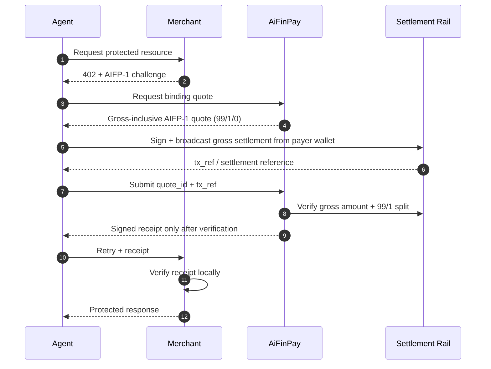

# AIFP-1 Merchant Integration Guide

**Document:** AIFP-DOC-02  
**Audience:** Merchant/backend engineers  
**Status:** Draft implementation guidance  
**Governed by:** [AIFP-1 RFC](./01-AIFP-1-RFC-Payment-Protocol-Specification.md)

This guide explains the merchant side of the AIFP-1 AI-traffic monetization flow. It does not assert that a particular merchant SDK package, hosted gateway route, chain, or deployment is production-ready unless that claim is supported by its own release/conformance evidence.

## 1. Merchant Mental Model

A merchant integration needs to do five things:

1. identify the protected resource and merchant;
2. determine whether access is free, blocked, or paid;
3. return a machine-readable AIFP-1 `402 Payment Required` challenge when payment is required;
4. verify an AIFP-1 receipt locally before granting access;
5. meter/consume the receipt or paid quota safely.

AIFP-1 is **not the same thing as AIFP-2/x402**. Both may use HTTP `402`, but AIFP-1 uses the current merchant-monetization economic profile `100/0`; AIFP-2 uses `0/0`.

## 2. Current Pricing And Economics

The price shown to the agent is the **gross AIFP-1 action price**. The agent settles that gross amount. AiFinPay receives 1% from gross, the merchant receives 99%, and no creator/referral fee is charged. The 1% protocol fee is **not added on top** of the displayed action price.

| Tier | Gross action price | Merchant 99% | AiFinPay 1% |
|---|---:|---:|---:|
| `standard` | `$0.0005` | `$0.000495` | `$0.000005` |
| `complex` | `$0.002` | `$0.00198` | `$0.00002` |
| `premium` | `$0.005` | `$0.00495` | `$0.00005` |

Current AIFP-1 settlement profile:

```text
gross_amount        = amount paid by the agent
payer_total_amount  = gross_amount
treasuryBps         = 100   # exactly 1% of gross to AiFinPay
creatorBps          = 0
protocol_fee_amount = 1% of gross
creator_amount      = 0
merchant_amount     = gross_amount - protocol_fee_amount
```

For a 6-decimal settlement asset, the Standard preset is exactly `500 gross → 495 merchant + 5 AiFinPay` base units.

Do not use the superseded `$0.00001 / $0.00006 / $0.00010` pricing, a `100/1` creator-fee profile, or fee-on-top AIFP-1 semantics for current integration guidance.

## 3. Integration Flow



The merchant is never expected to trust a payer-provided `tx_ref` as proof by itself. Receipt issuance is downstream of settlement verification.

## 4. Returning The 402 Challenge

Illustrative response:

```http
HTTP/1.1 402 Payment Required
Content-Type: application/json
```

```json
{
  "error": "AIFP-402",
  "protocol": "AIFP-1",
  "merchant_id": "mrch_example",
  "resource": "/api/data",
  "pricing_tier": "standard",
  "reference_price_usd": "0.0005",
  "quote_endpoint": "https://api.aifinpay.io/v1/quote"
}
```

Here `reference_price_usd` is the gross price the payer expects to settle, not the 99% merchant-net amount.

Challenge generation must be side-effect free. Returning a `402` must not itself consume paid quota or charge the payer.

A merchant should not describe this challenge as x402 merely because its HTTP status is `402`.

## 5. Resource Pricing

A simple static pricing policy can map routes to the three gross reference tiers:

```ts
type Tier = "standard" | "complex" | "premium";

const GROSS_REFERENCE_PRICE_USD: Record<Tier, string> = {
  standard: "0.0005",
  complex: "0.002",
  premium: "0.005"
};
```

The binding quote, not a local display string, is authoritative for a particular payment. A conforming quote makes the breakdown explicit:

```json
{
  "gross_amount": "0.0005",
  "payer_total_amount": "0.0005",
  "merchant_amount": "0.000495",
  "protocol_fee_amount": "0.000005",
  "creator_amount": "0",
  "treasury_bps": 100,
  "creator_bps": 0
}
```

Merchant middleware should use the effective paid quota/receipt claims when authorizing access.

Any future dynamic/custom pricing must be explicit and deterministic; stale AIP examples must not be treated as active policy.

## 6. Free Access And Identity

A merchant MAY provide a free allowance before charging. However, production quota MUST NOT be keyed only by a caller-controlled `AIFP-Agent-Id` header, because an agent could rotate arbitrary values to reset the allowance.

Use an identity mechanism suitable for the integration, for example:

- authenticated account/session;
- payer wallet/credential binding;
- signed agent identity;
- merchant-issued API credential;
- another durable identity that the client cannot reset at will.

Free-quota state should be atomic/concurrency-safe.

## 7. Merchant Receipt Verification

Before granting paid access, verify the active receipt profile at minimum:

1. signature and permitted algorithm;
2. trusted key/key identifier;
3. issuer;
4. merchant/audience;
5. resource or allowed scope;
6. gross paid amount/quota sufficiency;
7. expiry/freshness;
8. replay/consumption/idempotency rules.

Pseudocode:

```ts
async function authorizePaidRequest({ receipt, merchantId, resource, requiredGrossAmount }) {
  const claims = await verifySignatureAndClaims(receipt);

  if (claims.merchant_id !== merchantId) throw new Error("merchant mismatch");
  if (!scopeCovers(claims, resource)) throw new Error("resource mismatch");
  if (!exactDecimalGte(claims.gross_amount, requiredGrossAmount)) throw new Error("underpaid");
  if (isExpired(claims)) throw new Error("expired");
  if (!(await consumeOrMeterAtomically(claims, resource))) throw new Error("replay/quota exhausted");

  return claims;
}
```

Use integer minor units or exact decimal arithmetic for money. Do not use binary floating-point comparisons for settlement authorization.

## 8. Scope And Metering

A paid receipt may be scoped to:

- one exact URL/resource;
- a prefix or resource pool;
- a merchant-wide quota;
- another explicitly defined scope.

If one receipt covers multiple routes, the merchant must meter each actual action at its configured gross weight/price. A premium action cannot consume only one standard unit unless the protocol policy explicitly prices it that way.

Metering must be atomic where parallel requests could overspend the same paid quota.

## 9. Origin / Gateway Safety

If a hosted gateway proxies to a merchant upstream:

- validate the upstream target to prevent SSRF;
- re-check DNS/IP policy when necessary to mitigate DNS rebinding;
- never forward merchant origin secrets across an unintended redirect/origin;
- strip client-supplied internal control headers before injecting trusted gateway headers;
- use timeouts and size limits;
- log enough information for reconciliation without logging secrets.

## 10. Route And Settlement Readiness

The merchant should only expose a payable AIFP-1 route when the selected settlement path is verifier-ready and implements the gross-inclusive 99/1/0 split.

A route is not ready merely because:

- a contract/program address exists;
- a chain was deployed previously;
- an SDK can build a transaction;
- an RPC node returns the transaction hash;
- a contract reports `treasuryBps = 100` while actually adding that fee on top of the merchant amount.

The full payment path should prove:

`402 → gross quote → payer settles gross → verifier → 99% merchant / 1% AiFinPay / 0% creator → receipt → merchant verification → protected access → replay rejection`

If the verifier is unavailable or does not understand the deployed contract/profile, fail before payment.

## 11. Error Handling

Recommended behavior:

| HTTP | Merchant meaning |
|---|---|
| `402` | AIFP-1 payment required |
| `403` | policy or receipt authorization failure |
| `409` | replay/idempotency conflict |
| `410` | quote/authorization expired |
| `422` | receipt, settlement, or gross/net split mismatch |
| `425` | settlement/finality pending |
| `429` | rate/policy limit |
| `503` | payment/verifier service unavailable; do not imply success |

Do not turn a verifier outage into a `200` or a paid-access bypass.

## 12. Security Checklist

Before production authorization for a merchant integration:

- [ ] AIFP-1 vs AIFP-2 route detection is explicit.
- [ ] Current AIFP-1 economics are gross-inclusive `100/0`: payer gross = merchant 99% + AiFinPay 1%, creator 0%.
- [ ] The displayed/reference action price is the gross payer amount; 1% is not added on top.
- [ ] Current reference tier values are used where presets are selected.
- [ ] Unsupported/unverifiable settlement routes fail before payment.
- [ ] Receipt signature/audience/resource/expiry/amount checks fail closed.
- [ ] Replay/idempotency state is atomic.
- [ ] Free quota cannot be reset with a caller-controlled identifier alone.
- [ ] Money uses exact arithmetic.
- [ ] Token decimals are validated for each payment-live asset.
- [ ] Gateway/upstream configuration is SSRF-safe.
- [ ] Secrets are never returned in read APIs or logs.
- [ ] Reconciliation can identify gross payer amount, merchant amount, AiFinPay fee, creator amount, asset, chain, and tx reference.

## 13. What This Guide Does Not Guarantee

This document intentionally does not list unverified package versions, benchmark numbers, or a fixed number of payment-live networks. Those facts belong to the implementation/deployment evidence for the current release and can change independently from the protocol specification.

## References

- [AIFP-1 RFC](./01-AIFP-1-RFC-Payment-Protocol-Specification.md)
- [Protocol Economics](../economics.md)
- [OpenAPI](./08-OpenAPI-3.1-Specification.yaml)
- [JSON Schemas](./10-JSON-Schemas.md)
- [Security Specification](./04-Security-and-Cryptography-Specification.md)
