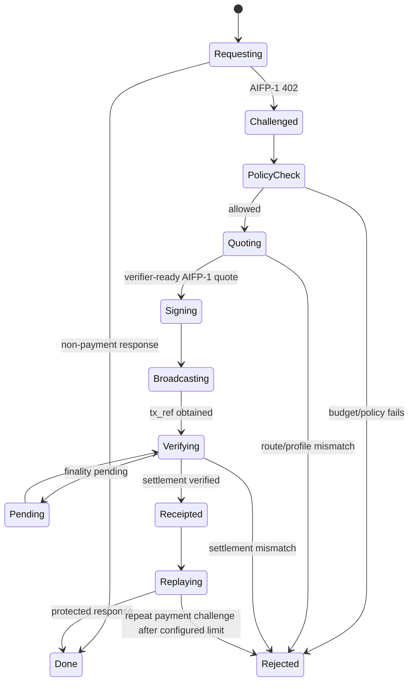

# AIFP-1 AI Agent SDK Specification

**Document:** AIFP-DOC-03  
**Audience:** AI-agent/SDK developers  
**Status:** Draft implementation specification  
**Governed by:** [AIFP-1 RFC](./01-AIFP-1-RFC-Payment-Protocol-Specification.md)

This document defines the expected behavior of an AIFP-1-aware agent client. It does not claim that every language package or chain adapter is already released or payment-live.

AIFP-1 is the merchant AI-traffic/resource monetization profile. **AIFP-2/x402 is separate.** A client may support both, but it must classify and route them explicitly.

## 1. Core Behavior

An AIFP-1-aware client handles this loop:

`request → AIFP-1 402 → policy → quote → local settlement → verify → receipt → retry`

The SDK should make payment automation possible without giving the AiFinPay receipt service custody of the payer's private key.

## 2. Current Economics

| Tier | AIFP-1 reference action price |
|---|---:|
| `standard` | `$0.0005` |
| `complex` | `$0.002` |
| `premium` | `$0.005` |

A valid AIFP-1 quote uses:

```text
routeClass   = AIFP-1
treasuryBps  = 100
creatorBps   = 0
```

AIFP-2/x402 uses `0/0`. A client MUST NOT silently substitute the route classes.

## 3. 402 Detection

HTTP status `402` alone does not prove the response is AIFP-1 or x402.

The client should inspect protocol-specific metadata. An AIFP-1 challenge should identify itself as AIFP-1 or provide enough AIFP-specific structure to classify it safely.

If the response is an unsupported payment protocol/version, the client must report that explicitly instead of guessing a payment path.

## 4. Payment State Machine



The SDK must not enter `Signing/Broadcasting` if the quote says the route is unsupported or unverifiable.

## 5. Quote Validation

Before signing anything, validate the binding quote:

- protocol/route class is `AIFP-1`;
- merchant matches the challenge/request;
- resource/scope is expected;
- quote is not expired;
- amount is within caller policy;
- `treasuryBps === 100`;
- `creatorBps === 0`;
- asset/chain is permitted by caller policy;
- settlement target is trusted/canonical for the selected route when a registry is used;
- verifier readiness/capability is present when required by the implementation.

If any required binding fails, do not pay.

## 6. Non-Custodial Settlement

The default crypto flow keeps signing local:

```text
quote
  ↓
SDK builds transaction / wallet request
  ↓
payer wallet signs locally
  ↓
payer broadcasts
  ↓
tx_ref / settlement reference
  ↓
POST /v1/pay for independent verification
  ↓
receipt only after verifier success
```

A client must never send a recovery phrase/private key/raw signer secret as part of `POST /v1/pay`.

## 7. Settlement Construction

The SDK must construct the call appropriate to the **actual canonical deployment version** for the selected chain/asset.

It should not infer the ABI/IDL from a stale version string alone. A deployment registry, when used, should bind at least:

- network/chain ID;
- contract/program address;
- implementation/version identifier;
- supported payment entrypoint;
- fee profile;
- supported asset/token metadata;
- verifier status/provenance.

Legacy `100/1` splitters must not be selected for current AIFP-1 `100/0` payments unless their deployed configuration has actually been changed and verified to match the current profile.

## 8. Monetary Arithmetic

Use integer token units or exact decimal arithmetic.

Do not use JavaScript/Python/other binary floats to decide whether a settlement paid enough.

Token-decimal conversion must be based on the actual token decimals for the selected chain/asset. A 6-decimal token and an 18-decimal token cannot share a hard-coded raw-unit divisor unless the conversion explicitly normalizes them.

## 9. Budget Control

Budget policy is checked before signing/broadcasting.

Recommended limits include:

- per payment;
- rolling/daily spend;
- per merchant;
- allowed chains/assets;
- allowed route classes;
- optional approval threshold.

### 9.1 Concurrency and durability

If an SDK promises a durable spending cap, it must survive process restart and must not be bypassable by concurrent requests.

A safe pattern is:

`reserve → payment attempt → commit | release`

where reservations participate in subsequent budget checks atomically.

A process-local counter is not sufficient for a persistent/durable cap.

## 10. Idempotency And Replay

The SDK should attach a unique idempotency key to settlement-verification submission.

It must treat a unique quote/payment/settlement ID as consumable according to protocol rules and must not intentionally submit the same on-chain settlement as payment for multiple receipts/resources.

Retries caused by transport errors must not cause a second payment.

## 11. Receipt Handling

A client may sanity-check a receipt before replay, but merchant verification remains authoritative for resource access.

Receipt cache keys should include enough scope to prevent cross-merchant/resource reuse.

Do not cache an expired or invalid receipt. Do not convert a failed receipt replay into an automatic second payment without an explicit retry policy and budget check.

## 12. High-Level `fetchPaid` Behavior

Pseudocode:

```ts
async function fetchPaid(url, options) {
  const first = await fetch(url, options);
  if (first.status !== 402) return first;

  const challenge = detectAifp1(first);
  if (!challenge) return routeOrReturnUnsupported(first);

  await policy.assertAllowed(challenge);

  const quote = await createQuote(challenge);
  validateAifp1Quote(quote); // 100/0, merchant/resource, expiry, route
  await policy.reserve(quote);

  try {
    const tx = await buildSettlement(quote);
    const txRef = await wallet.signAndBroadcast(tx);
    const receipt = await submitForVerification({ quote, txRef });
    await policy.commit(quote);
    return retryWithReceipt(url, options, receipt);
  } catch (error) {
    await policy.release(quote);
    throw error;
  }
}
```

Actual implementations must handle the ambiguity of whether a broadcast occurred before a transport/process failure. They should reconcile by payment/transaction ID rather than blindly broadcasting again.

## 13. Route Isolation With AIFP-2/x402

A combined SDK may support both:

```text
AIFP-1 challenge → AIFP-1 100/0 path
x402 challenge   → AIFP-2 0/0 path
```

Rules:

- forced/explicit x402 intent must not be reinterpreted as AIFP-1;
- an AIFP-1 budget rejection must not be bypassed by retrying through x402;
- a legacy fee-bearing splitter must not be used as fallback for AIFP-2;
- unsupported x402 versions should produce an explicit unsupported-version error, not a false success or unrelated facilitator error.

## 14. Agent Identity

A caller-supplied `AIFP-Agent-Id` string is an identifier/hint, not sufficient authenticated identity by itself.

Durable free quota, reputation, or delegated authority must be bound to an identity mechanism that cannot be reset by simply changing an arbitrary header.

Agent Passport belongs to the separate AIFP-3 identity protocol surface and should not be presented as part of the normative AIFP-1 payment object model.

## 15. Wallet Packaging

Wallet creation/derivation should be separable from heavy on-chain transaction dependencies when practical. An agent that only needs to create/show a wallet should not necessarily need the entire settlement stack.

Package names and current published versions belong to their actual SDK repository/package registry and must not be invented in this specification.

## 16. Error Model

An AIFP-1 SDK should distinguish at least:

- unsupported payment protocol/version;
- budget/policy rejection;
- quote expired;
- quote route/economics mismatch;
- no verifier-ready route;
- insufficient balance/gas;
- local signing failure;
- broadcast unknown/pending;
- settlement pending/finality;
- settlement mismatch/underpayment;
- replay/idempotency conflict;
- invalid receipt;
- protected replay still challenged.

Errors before signing should not spend funds. Errors after a possible broadcast need reconciliation before any retry that could duplicate payment.

## 17. Test Requirements

A conforming SDK implementation should test:

1. AIFP-1 challenge detection.
2. AIFP-2/x402 not misclassified as AIFP-1.
3. Current reference tier values.
4. `100/0` accepted; `100/1` rejected for current AIFP-1.
5. `0/0` rejected on the AIFP-1 route.
6. Merchant/resource mismatch rejected.
7. Expired quote rejected before signing.
8. Unsupported verifier route rejected before signing.
9. Tiny supported payments use correct decimal/rounding semantics.
10. Parallel payments cannot bypass budget caps.
11. Restart does not reset a promised durable cap.
12. Broadcast/retry logic does not duplicate settlement.
13. Valid verified settlement yields one receipt.
14. Replay/duplicate settlement consumption is rejected.
15. Receipt is scoped to the intended merchant/resource.

## 18. Conformance Statement

An SDK should only claim AIFP-1 support for the chains/assets/routes for which its transaction builder, registry, settlement verifier, tests, and release evidence are mutually consistent.

A list of deployed networks is not equivalent to a list of AIFP-1 payment-live routes.

## References

- [AIFP-1 RFC](./01-AIFP-1-RFC-Payment-Protocol-Specification.md)
- [Merchant Guide](./02-Merchant-Integration-Guide.md)
- [Security Specification](./04-Security-and-Cryptography-Specification.md)
- [OpenAPI](./08-OpenAPI-3.1-Specification.yaml)
- [JSON Schemas](./10-JSON-Schemas.md)
- [Protocol Economics](../economics.md)
