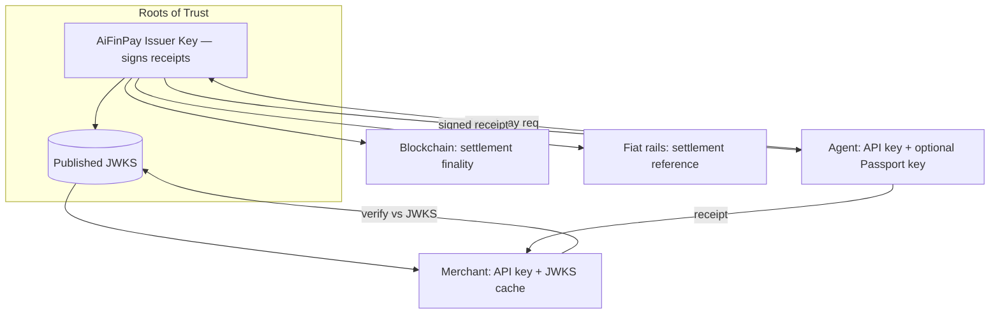
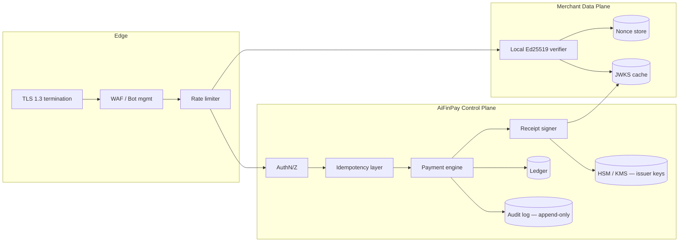
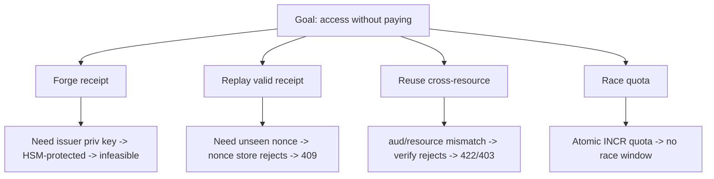
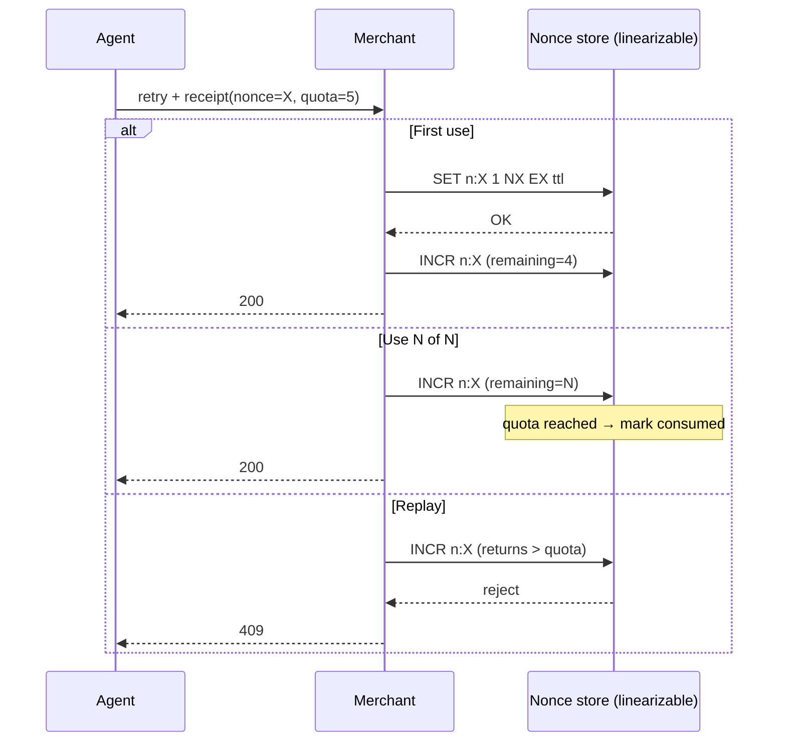
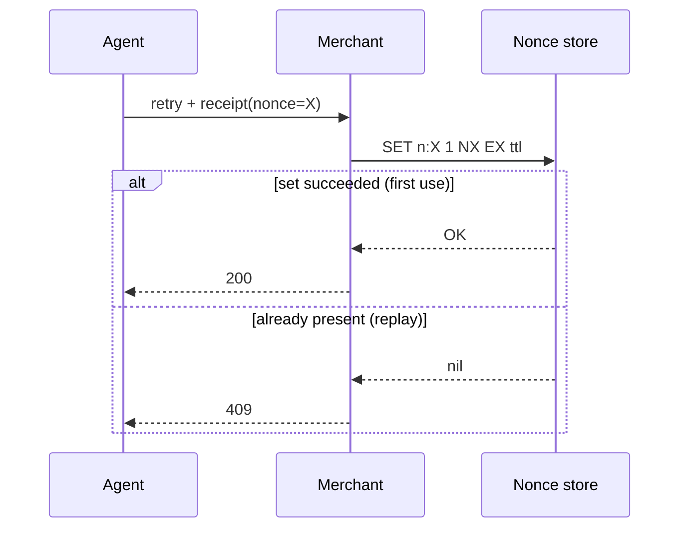
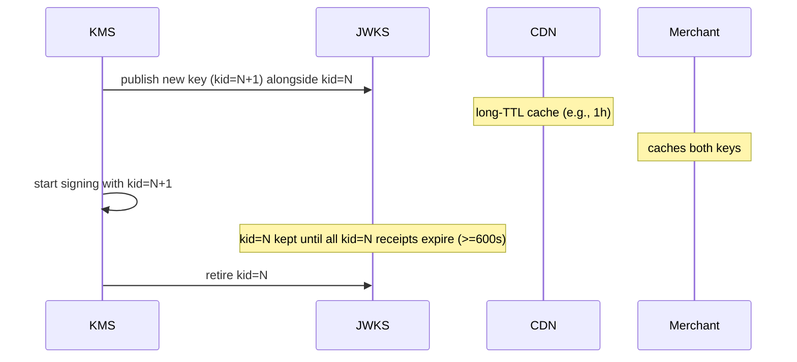

# AiFinPay Security & Cryptography Specification

**Document:** AIFP Security & Cryptography Specification
**Audience:** Security engineers, protocol implementers
**Status:** Stable
**Version:** 1.0.0
**Date:** June 28, 2026
**Contact:** security@aifinpay.io · https://docs.aifinpay.io/security

> This is **Document 4 of 4** in the official AiFinPay documentation set:
>
> 1. [AIFP-1 — Payment Protocol Specification](./01-AIFP-1-RFC-Payment-Protocol-Specification.md) — the normative standard
> 2. [Merchant Integration Guide](./02-Merchant-Integration-Guide.md)
> 3. [AI Agent SDK Specification](./03-AI-Agent-SDK-Specification.md)
> 4. **Security & Cryptography Specification** *(this document)*
>
> This document is **self-contained** for security review. It conforms to AIFP-1; where protocol details are summarized, the [AIFP-1 specification](./01-AIFP-1-RFC-Payment-Protocol-Specification.md) governs.

---

## Copyright Notice

Copyright © 2026 AiFinPay, Inc. Licensed under CC BY 4.0. Reference code is Apache-2.0/MIT.

---

## Table of Contents

1. [Security Objectives](#1-security-objectives)
2. [Trust Model](#2-trust-model)
3. [Security Architecture](#3-security-architecture)
4. [Threat Model (STRIDE + Attack Trees)](#4-threat-model-stride--attack-trees)
5. [Authentication](#5-authentication)
6. [Authorization](#6-authorization)
7. [Cryptographic Primitives](#7-cryptographic-primitives)
8. [Receipt Token Format & Signature Verification](#8-receipt-token-format--signature-verification)
9. [Replay Protection & Nonce Management](#9-replay-protection--nonce-management)
10. [Idempotency & Double-Spend Prevention](#10-idempotency--double-spend-prevention)
11. [Key Management & Rotation](#11-key-management--rotation)
12. [API Key Security](#12-api-key-security)
13. [Wallet Security & MPC](#13-wallet-security--mpc)
14. [Smart Contract & Chain Security](#14-smart-contract--chain-security)
15. [Fiat Settlement Security](#15-fiat-settlement-security)
16. [Rate Limiting, DDoS & Abuse Prevention](#16-rate-limiting-ddos--abuse-prevention)
17. [Fraud Detection & Reputation](#17-fraud-detection--reputation)
18. [Monitoring & Audit Logging](#18-monitoring--audit-logging)
19. [Secure Defaults & Security Checklist](#19-secure-defaults--security-checklist)
20. [OWASP, SOC 2 & ISO 27001 Mapping](#20-owasp-soc-2--iso-27001-mapping)
21. [Glossary](#21-glossary)
22. [References](#22-references)

---

# 1. Security Objectives

AIFP moves money between machines with no human in the loop. Its security objectives, in priority order:

1. **Integrity of payment proof.** A receipt MUST be unforgeable and tamper-evident. Forging one MUST be cryptographically infeasible.
2. **No double value transfer.** A single logical payment MUST settle at most once; a receipt MUST grant access at most as intended.
3. **No replay.** A captured challenge or receipt MUST NOT be reusable beyond its single intended redemption.
4. **Tight binding.** A receipt MUST be usable only by/for the audience, resource, and amount it was issued for.
5. **Availability under attack.** Local verification MUST keep merchants serving even during backend outage or DDoS.
6. **Confidentiality in transit.** All traffic MUST be encrypted (TLS 1.3); no secret material MUST live inside a receipt.
7. **Least privilege.** Credentials and delegations MUST be narrowly scoped and rotatable.

---

# 2. Trust Model



| Party | Trusted for | NOT trusted for |
|---|---|---|
| **AiFinPay Issuer** | Signing valid receipts; assuming settlement risk for issued receipts | Reading merchant data; holding non-custodial keys |
| **Agent** | Authenticating with its key; paying within budget | Asserting payment without a signed receipt |
| **Merchant** | Verifying receipts; serving resources | Minting receipts; altering claims |
| **Network** | Nothing | Everything — every artifact is signed |

**Root of trust:** the AiFinPay **issuer signing key**, published as a rotating **JWKS**. A merchant trusts a receipt iff it verifies against a current `kid` in that JWKS. Compromise of the issuer key is the catastrophic event the key-management program (Section 11) exists to prevent.

---

# 3. Security Architecture



Defense in depth: TLS at the edge; WAF/rate-limit before any compute; **local verification** on the data plane (no backend dependency); issuer keys in **HSM/KMS**; append-only **audit log**; idempotency before payment.

---

# 4. Threat Model (STRIDE + Attack Trees)

## 4.1. STRIDE

| Category | Threat | Mitigation |
|---|---|---|
| **Spoofing** | Forge a receipt | EdDSA over issuer key; `kid`-pinned JWKS; infeasible without issuer private key |
| **Spoofing** | Impersonate an agent | API key + optional Passport Ed25519 signature |
| **Tampering** | Modify claims (amount/resource/aud) | Signature covers all claims; any edit invalidates |
| **Tampering** | Alter webhook | HMAC-SHA256 signature + timestamp |
| **Repudiation** | "I never paid" | On-chain `tx_ref` + signed receipt + append-only audit log |
| **Information disclosure** | Sniff traffic / leak secrets | TLS 1.3; no secrets in receipts; secret-redacting logs |
| **DoS** | Flood challenge/verify | Local verify (cheap), rate limits, anycast, WAF |
| **Elevation** | Replay/reuse receipt | Single-use nonce + idempotency keys |
| **Elevation** | Cross-resource/merchant reuse | `aud` + `resource` binding enforced on verify |

## 4.2. Attack tree — "redeem a receipt I did not pay for"



Every leaf terminates in a mitigation. There is no path to the goal without compromising the HSM-held issuer key.

---

# 5. Authentication

## 5.1. Two planes

- **Control-plane auth** — API keys (`sk_live_*` secret, `pk_live_*` publishable). Bearer tokens over TLS 1.3. Scoped to merchant or agent. Keys are hashed at rest (Argon2id), shown once, and rotatable.
- **Data-plane auth** — the **Receipt Token** itself authenticates *access*. A valid receipt needs no API key on the retried request.

## 5.2. Agent Passport authentication

Where used, an agent proves identity by signing a challenge with its Passport Ed25519 key (`pp_*`). Delegated sub-agents present a delegation chain signed by the owner. Verification MUST check signature, scope, expiry, **delegation depth (≤ 5 levels, see §13)**, and cycle detection over visited `pp_*` IDs.

**Passport is REQUIRED for identity-bound features.** Anonymous payment (funded wallet, no Passport) is permitted, but the following MUST require a Passport:

- **Budget policy attribution** — `per_window`, `per_merchant`, daily/monthly caps are bound to a Passport's `passport_id`. `AIFP-Agent-ID` header alone is NOT a sufficient identity for budget spend.
- **Reputation / trust-level** — `reputation`, `risk`, `trust_level` claims only apply when a valid Passport is presented.
- **Free-quota attribution** — quota SHOULD be keyed by Passport `passport_id` or the Ed25519 public key hash, not by an unauthenticated header.

Without a Passport, requests are anonymous and MAY still receive free quota (per-IP rate-limited), but MUST NOT be attributed to a persistent identity, budget, or reputation that another actor could spoof.

---

# 6. Authorization

Authorization is **capability-based**: possession of a valid, correctly scoped receipt is the capability to access a resource. Verification MUST enforce:

- `aud == merchant_id` (no cross-merchant use) → else `403`.
- `resource == requested resource` (no cross-resource use) → else `422`.
- `amount >= required price` → else `422`.
- `now < exp` → else `402`.
- `nonce` unseen → else `409`.

Independently, a merchant MAY apply **policy authorization** (blocklist `agt_*`, KYC gates, geofencing) returning `403`. Budget authorization on the agent side returns `AIFP-403-BUDGET-EXCEEDED` when a payment would breach policy.

---

# 7. Cryptographic Primitives

| Purpose | Primitive | Notes |
|---|---|---|
| Receipt signature | **EdDSA / Ed25519** | Fast verify (~50k/s/core), small sigs, deterministic |
| Receipt encoding | **JWT (JOSE)** / **CWT (COSE)** | Text (JWS) or compact binary (COSE) |
| Webhook signature | **HMAC-SHA256** | Shared secret per merchant; timestamped |
| Transport | **TLS 1.3** | MUST; modern cipher suites only |
| Hashing | **SHA-256 / SHA-512** | Fingerprints, content hashing |
| API key at rest | **Argon2id** | Memory-hard; never store plaintext keys |
| MPC signing | **Threshold Ed25519 / ECDSA** | t-of-n, no single key materializes |
| Randomness | **CSPRNG** | Nonces ≥128 bits from OS CSPRNG |

**Non-goals / disallowed:** no `alg: none`, no HS256 for receipts (asymmetric only so merchants never hold a signing secret), no MD5/SHA-1, no TLS < 1.2 (1.3 REQUIRED for new deployments).

---

# 8. Receipt Token Format & Signature Verification

## 8.1. JWS/JWT receipt

Header:
```json
{ "alg": "EdDSA", "typ": "JWT", "kid": "aifp-2026-06" }
```
Claims (AIFP-1 §7.3): `iss, sub, aud, resource, pricing_tier, amount, currency, asset, chain, tx_ref, receipt_id, nonce, iat, exp`. Default TTL **600 s**.

## 8.2. Verification (normative)

```python
from decimal import Decimal

def verify_receipt(token, merchant_id, resource, required_amount, jwks, nonce_seen, mark_nonce):
    header = jwt_header(token)                       # read kid
    key = jwks.get(header["kid"])                    # resolve current key
    if key is None: raise Reject(422, "unknown kid") # may trigger JWKS refresh
    claims = jwt_verify(token, key, alg="EdDSA")     # signature + exp (verifies or raises)
    if claims["iss"] != ISSUER:        raise Reject(422, "bad issuer")
    if claims["aud"] != merchant_id:   raise Reject(403, "wrong audience")
    if claims["resource"] != resource: raise Reject(422, "resource mismatch")
    if Decimal(claims["amount"]) < Decimal(required_amount): raise Reject(422, "amount low")  # decimal, NOT float
    if now() >= claims["exp"] - 0:     raise Reject(402, "expired")   # ≤30s skew allowed
    if nonce_seen(claims["nonce"]):    raise Reject(409, "replay")
    mark_nonce(claims["nonce"], ttl=claims["exp"] - now())
    return claims
```

The verification is **pure** except for the nonce store touch. It MUST NOT contact AiFinPay. A failure MUST map to the precise status code so the agent recovers correctly (AIFP-1 §17).

> **Amount comparison MUST use decimal or integer arithmetic, never floating point.** Micropayment amounts have up to 8 decimal places (e.g., `0.00001`); IEEE-754 `float`/`double` cannot represent many such values exactly and a rounding error near a tier boundary can flip the comparison — accepting a receipt for `0.0000099999...` or rejecting a legitimate `0.00001`. Use a decimal type (`decimal.Decimal`, `BigDecimal`, `decimal.Decimal`), or convert to integer minor units (e.g., micro-USD × 10⁸) before comparing.

## 8.3. CWT/COSE variant

For constrained agents, the same claim set is encoded as a CBOR Web Token signed with COSE/EdDSA. Verification is identical in logic; the merchant selects the codec by `cty`/capability negotiation.

> **Codec negotiation (Future Extension, normative when implemented).** When the CWT/COSE variant becomes normative, it MUST be negotiated per-request via explicit `Accept` request headers (e.g., `Accept: application/jwt` or `Accept: application/cwt`). Capability advertisement (`/.well-known/aifp` returning `["jwt","cwt"]`) MUST NOT be sufficient by itself — the merchant MUST reject a receipt whose encoding was not explicitly requested by the agent in the original request. **Codec-confsion attacks** (sending a different encoding than the one the agent claimed to send) MUST be mitigated by strict per-request encoding matching. The merchant MUST NOT auto-detect encoding from the receipt alone.

---

# 9. Replay Protection & Nonce Management

- Every challenge and receipt carries a **single-use nonce**, ≥128 bits from a CSPRNG.
- The merchant maintains a **nonce store** (Redis or sharded in-memory) keyed by nonce with **TTL = receipt TTL** (~600 s). On redemption the nonce is written; a re-presented nonce → `409`.
- Because TTL is short, the store only ever holds nonces from the last few minutes — bounded memory even at billions of receipts/day.
- **Clock skew:** allow ≤5 s tolerance on `exp` to avoid false expiries across hosts; never more.
- **Distributed correctness (linearizability required).** The nonce store MUST provide **linearizable** semantics for `SET NX EX ttl`. Asynchronous replication (default in many Redis Sentinel/Cluster deployments) is **insufficient**: two concurrent presentations of the same nonce from different merchant instances can both observe `nil` if the `SET NX` has not yet replicated, allowing double-redemption.
  - Conforming implementations MUST use one of:
    1. **Strongly consistent store** (etcd, Consul, ZooKeeper) for the nonce store.
    2. **Redis with synchronous replication** (WAIT ≥ 1 replica acknowledged after each `SET NX`), e.g., `SET ... NX EX ttl` immediately followed by `WAIT 1 1000`.
    3. **Consistent-shard routing** — route an agent's receipts to a single shard via consistent hashing so concurrent presentments of the same nonce are serialized on that shard.
    4. **Local in-process nonce store** for single-instance deployments (process-locked, no replication).
  - The canonical primitive is `SET nonce value NX EX ttl` (set-if-absent with expiry), but it MUST be coupled with one of the consistency mechanisms above.
  - **Multi-use receipts (`quota` claim):** when a receipt carries a `quota` claim (Section 7.5), the store MUST track `(nonce, use_count)` atomically (e.g., Lua script `INCR` with cap check, or equivalent). The nonce is consumed only when `use_count` reaches `quota`. Single-use receipts (`quota` absent) track presence only.





---

# 10. Idempotency & Double-Spend Prevention

- **Payment idempotency:** `Idempotency-Key` on `/pay` makes a timed-out retry safe. The Control Plane stores `(api_key, key) → response` for 24 h; identical key+body returns the stored response; same key + different body → `409`. Result: **at-most-once** charge per logical payment.
- **Receipt single-use:** the nonce store guarantees one receipt unlocks one access (unless a multi-use `quota` claim is present).
- **On-chain finality:** `tx_ref` ties a receipt to a settlement transaction, giving non-repudiable proof and preventing a second settlement for the same payment intent.

Together these provide an end-to-end **exactly-once value transfer with at-most-once redemption** guarantee.

---

# 11. Key Management & Rotation

## 11.1. Issuer keys (root of trust)

- Generated and held in **HSM / cloud KMS**; the private key never leaves the boundary. Signing is an API call into the HSM.
- Published as **JWKS** with multiple active `kid`s during overlap windows.

## 11.2. Rotation procedure



- New receipts sign with the new `kid`; old `kid` stays in JWKS until every receipt it signed has expired (≥ receipt TTL).
- Merchants **MUST** refresh JWKS on encountering an unknown `kid`. To prevent thundering-herd DoS at rotation time, the following are **normative**:
  1. **Rate-limited exponential backoff with full jitter.** A conforming client MUST cap refresh attempts (e.g., ≤ 1 refresh per IP/Merchant-ID per ≤ 60 s) and MUST apply exponential backoff with full jitter on 429 or 5xx responses (RFC 9110 §10.2 `Retry-After` if present).
  2. **JWKS MUST be CDN-cacheable** with a long `Cache-Control` `max-age` (e.g., 3600 s). The `/.well-known/jwks.json` endpoint MUST return `Cache-Control` and `ETag` headers so origin load is bounded.
  3. **`kid` format validation.** An implementation MUST validate `kid` against a known pattern (e.g., `^aifp-[0-9]{4}-[0-9]{2}$`) before triggering a JWKS refresh. Unknown-format `kid` values MUST be rejected (422) without a refresh.
  4. **Refresh-budget cap.** A conforming implementation MUST bound consecutive failed refreshes for the same merchant (e.g., max 5) before failing closed (reject all receipts with that merchant's `aud`) and alarming.
- **Compromise response:** immediately retire the affected `kid`, publish a revocation, force re-sign, and rotate. Already-expired short-TTL receipts limit blast radius to minutes. The compromise-response document MUST include a `kid` revocation list reachable at the same JWKS URL, and merchants MUST check it on every refresh.
- **Staggered rotation (operational guidance, server-side).** When rotating an issuer key, the control plane SHOULD introduce the new `kid` gradually (e.g., dual-sign for a transitional window) and SHOULD deliver the new JWKS to CDN before signing with the new key, so that the first batch of new `kid` receipts can already be verified.

## 11.3. Webhook & API key rotation

Webhook HMAC secrets and API keys support dual-secret rotation (accept old+new during overlap). Keys are revocable instantly from the dashboard.

- Webhook HMAC secrets SHOULD rotate automatically every **≤ 90 days**; merchants SHOULD support dual-secret overlap. Implementations MAY derive per-webhook-endpoint keys from a master secret via HKDF (RFC 5869) to limit blast radius if a derived key leaks.

---

# 12. API Key Security

- Format: `sk_live_*` (secret, server-only), `pk_live_*` (publishable). Test variants `sk_test_*`.
- Stored hashed (Argon2id); never logged or returned after creation.
- Scoped (merchant vs. agent), least-privilege; support IP allow-lists and per-key rate limits.
- **Leak handling:** automated secret-scanning; on detection, auto-revoke and notify. Treat any `sk_*` in client code, logs, or VCS as compromised.

---

# 13. Wallet Security & MPC

| Model | Key custody | Threat posture |
|---|---|---|
| Custodial | AiFinPay HSM | Strong operational security; AiFinPay is trusted custodian |
| Non-custodial | Agent-held | Agent fully responsible; key never sent to AiFinPay |
| **MPC** | t-of-n shares | No single point holds a usable key; tolerates share compromise |

**MPC (recommended for enterprise):** threshold Ed25519/ECDSA splits signing across `n` parties; any `t` cooperate to sign, fewer than `t` learn nothing. No complete private key ever materializes, on any host, at any time. Share refresh (proactive secret sharing) periodically re-randomizes shares without changing the address. Spending policies (per-request/daily caps, allow-lists) are enforced as **pre-sign authorization**, so a compromised share cannot exceed policy.

---

# 14. Smart Contract & Chain Security

- **Payment splitter** (non-custodial): routes protocol fee and multi-party splits atomically; designed for a minimal surface; reentrancy-guarded; pull-payment pattern where applicable. External review status must be linked before any implementation claims third-party review.
- **mSECCO escrow** (Full Core networks): binds Passport wallets and backs streaming channels; funds released only on signed conditions.
- **Oracle:** **Pyth** price feeds for asset/USD conversion; staleness and confidence-interval checks before using a price.
- **Chain risk:** confirmation-depth policy per chain for high-value resources; re-org awareness; per-network capability tiers (Full Core / Splitter-only EVM / Splitter MVP non-EVM, AIFP-1 Appendix B).
- **Contract upgradeability:** timelock + multisig on any upgradeable component; immutable where possible.

---

# 15. Fiat Settlement Security

- Hybrid fiat/stablecoin settlement via regulated rails. The receipt's `tx_ref` carries the settlement reference.
- **Controls:** sandbox/production isolation, signed settlement callbacks, reconciliation against the ledger, AML/KYC at the rail boundary (applies to merchant payouts, not to per-request agent micropayments).
- **Chargeback/dispute:** `dispute.opened` webhook; AiFinPay assumes settlement risk for issued receipts, so a merchant who served against a valid receipt is not exposed to the agent's funding risk.

---

# 16. Rate Limiting, DDoS & Abuse Prevention

| Layer | Control |
|---|---|
| Edge | Anycast, WAF, SYN/flood protection, geo/ASN heuristics |
| Gateway | Token-bucket per API key + per IP; `429` + `Retry-After`; `RateLimit-*` headers |
| Challenge path | Rate-limited to blunt nonce-harvesting and challenge floods |
| Verify path | Local & cheap by design; not a DoS amplifier (no backend call) |
| Assisted `/v1/verify` | OPTIONAL fallback only (constrained proxies); aggressive per-key rate limit + `429`; MUST NOT carry routine verification traffic — routing routine verify load to the control plane reintroduces a backend dependency and a DoS amplifier the stateless design exists to eliminate |
| Pay path | Idempotency + budget caps bound spend even under abuse |
| JWKS path | CDN-cached with long `Cache-Control` + `ETag`; client-side exponential backoff with full jitter on 429/5xx; per-merchant refresh cap (≤ 1/min) and total-failure budget; `kid` regex pre-validation before refresh (§11.2) — prevents thundering-herd DoS at issuer key rotation |

Because verification is local and stateless, a DDoS against merchants cannot be amplified through AiFinPay, and an AiFinPay outage cannot take down merchant verification.

---

# 17. Fraud Detection & Reputation

- **Signals:** velocity (pays/sec), failed-verify ratio, nonce-replay attempts, chargeback rate, anomalous chain/asset switching, budget-breach frequency.
- **Agent Reputation Network:** `reputation ∈ [0,1000]` (start 500), `risk ∈ [0,100]`, trust levels `untrusted | basic | verified | enterprise`. Reputation rises with successful, dispute-free settlement and falls with fraud/abuse. Merchants MAY require a minimum trust level or apply reputation-based pricing (max −30% discount).
- **Actions:** step-up (require Passport / higher confirmations), throttle, or blocklist (`403`). All automated decisions are logged and appealable via governance.

---

# 18. Monitoring & Audit Logging

- **Audit log:** append-only, tamper-evident (hash-chained) record of payments, receipt issuance/redemption, key rotations, policy changes. Retained per compliance policy.
- **Metrics:** `aifp_verify_fail_total{reason}`, `aifp_replay_blocked_total`, `aifp_402_total`, `aifp_pay_total{status}`, signer latency, JWKS refresh rate, p99 verify latency.
- **Alerting:** spikes in `422`/`409`, JWKS refresh storms, unusual spend velocity, settlement failures.
- **Tracing:** `AIFP-Request-ID` propagated end-to-end for forensics.

---

# 19. Secure Defaults & Security Checklist

**Secure defaults (shipped on):** TLS 1.3; EdDSA-only receipts; `alg:none` rejected; 600 s receipt TTL; mandatory nonce store; 24 h idempotency; budget caps required on agents; secrets hashed (Argon2id); webhooks HMAC-signed + timestamp-checked.

**Implementer checklist:**
```text
[ ] TLS 1.3 enforced everywhere
[ ] Receipts verified locally vs current JWKS (EdDSA), aud+resource+amount+exp+nonce checked
[ ] alg pinned to EdDSA; alg:none and HS* rejected for receipts
[ ] Nonce store present, atomic SET NX EX, TTL = receipt TTL, **linearizable consistency** (§9)
[ ] Idempotency-Key honored on /pay for 24h
[ ] JWKS cached + refreshed on unknown kid (rate-limited, exponential backoff with full jitter, CDN-cached, kid regex pre-validation — §11.2)
[ ] Issuer keys in HSM/KMS; rotation with overlap; compromise runbook ready
[ ] sk_* server-only, hashed at rest, scoped, rotatable; secret scanning on
[ ] Webhooks: verify HMAC + 5-min timestamp window **and** track webhook event `id` for replay rejection (TTL ≥ 24 h)
[ ] Rate limits + WAF on challenge/pay paths
[ ] Budgets enforced pre-sign; AIFP-403-BUDGET-EXCEEDED on breach
[ ] Append-only audit log + metrics + alerting wired
[ ] Degraded mode verified (merchant serves valid receipts during backend outage; revoked-receipt residual risk bounded by TTL documented)
```

---

# 20. OWASP, SOC 2 & ISO 27001 Mapping

## 20.1. OWASP API Security Top 10 (2023)

| Risk | AIFP control |
|---|---|
| API1 Broken Object Level Auth | `aud`/`resource` binding on every receipt |
| API2 Broken Authentication | Asymmetric receipts, scoped API keys, MPC |
| API3 Broken Object Property Level Auth | Signature covers all claims; no client-mutable fields |
| API4 Unrestricted Resource Consumption | Quota + rate limits + budgets |
| API5 Broken Function Level Auth | Capability model; policy authorization layer |
| API6 Sensitive Business Flows | Idempotency + nonce + audit on pay/redeem |
| API7 SSRF | No user-controlled fetch in verification path |
| API8 Security Misconfiguration | Secure defaults shipped on |
| API9 Improper Inventory Mgmt | Versioned `/v1`, JWKS `kid` inventory |
| API10 Unsafe Consumption of APIs | TLS 1.3, signed responses, schema validation |

## 20.2. SOC 2 (Trust Services Criteria)

| TSC | How AIFP supports it |
|---|---|
| Security | Defense-in-depth, HSM keys, least privilege, monitoring |
| Availability | Local verification + degraded mode + multi-region |
| Processing Integrity | Idempotency, exactly-once settlement, hash-chained audit |
| Confidentiality | TLS 1.3, no secrets in receipts, secret hygiene |
| Privacy | Agents pay without human PII; minimal data collection |

## 20.3. ISO/IEC 27001 (Annex A themes)

Cryptography (A.8.24) — EdDSA/TLS/HSM; Access control (A.5.15–18) — scoped keys, MPC; Logging & monitoring (A.8.15–16) — audit log, alerting; Secure development (A.8.25–28) — external review process, secure defaults; Supplier/rails (A.5.19–22) — regulated fiat partners. A formal Statement of Applicability is maintained by the AiFinPay security program.

---

# 21. Glossary

Canonical glossary: AIFP-1 [Appendix A](./01-AIFP-1-RFC-Payment-Protocol-Specification.md#appendix-a-glossary). Security-specific terms: **Issuer Key**, **JWKS / kid**, **Nonce Store**, **Idempotency Key**, **MPC (threshold signing)**, **mSECCO escrow**, **Payment Splitter**, **Reputation/Risk/Trust Level**, **HSM/KMS**, **Degraded Mode**, **Append-only Audit Log**.

---

# 22. References

- [AIFP-1 — Payment Protocol Specification](./01-AIFP-1-RFC-Payment-Protocol-Specification.md) (normative; §7 receipts, §18 security summary).
- [Merchant Integration Guide](./02-Merchant-Integration-Guide.md) (§5 verification, §9 security).
- [AI Agent SDK Specification](./03-AI-Agent-SDK-Specification.md) (§7 budgets, §9 Passport).
- [RFC 8032] EdDSA · [RFC 7519] JWT · [RFC 8037] EdDSA in JOSE · [RFC 8949] CBOR · [RFC 9052] COSE · [RFC 8392] CWT.
- OWASP API Security Top 10 (2023); SOC 2 Trust Services Criteria; ISO/IEC 27001:2022.

---

*End of Security & Cryptography Specification. © 2026 AiFinPay, Inc. Licensed CC BY 4.0.*
