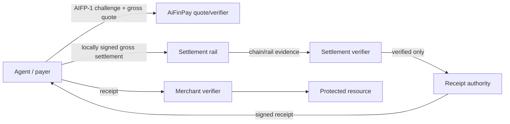

# AIFP-1 Security & Cryptography Specification

**Document:** AIFP-DOC-04  
**Audience:** Security engineers, protocol implementers  
**Status:** Draft security specification  
**Governed by:** [AIFP-1 RFC](./01-AIFP-1-RFC-Payment-Protocol-Specification.md)

This document defines security requirements for the AIFP-1 merchant-monetization profile. It describes required security properties, not a claim that every referenced implementation currently satisfies them.

## 1. Security Objectives

AIFP-1 should preserve, in priority order:

1. **No receipt without verified settlement.**
2. **No payment into a route the receipt service cannot verify.**
3. **Correct merchant/resource/gross/split binding.**
4. **Gross value conservation.** For current AIFP-1, payer total equals gross; merchant + AiFinPay fee + creator equals gross; fee-on-top is rejected.
5. **No duplicate receipt entitlement from one settlement.**
6. **No cross-route economic confusion.** AIFP-1 is gross-inclusive `100/0`; AIFP-2/x402 is `0/0`.
7. **No private-key custody required for the non-custodial payer flow.**
8. **Exact monetary arithmetic and correct token decimals.**
9. **Replay/idempotency protection.**
10. **Fail-closed merchant receipt authorization.**
11. **Auditable/reconcilable financial state.**

## 2. Trust Boundaries



The critical trust transitions are:

- **quote → signing:** client trusts route/economic metadata enough to spend the quoted gross amount;
- **settlement → receipt:** verifier determines whether actual payment matches the quote and required 99/1/0 split;
- **receipt → access:** merchant determines whether the receipt authorizes this resource/scope.

## 3. Current Economic Security Invariant

Current AIFP-1:

```text
gross_amount         = commercial amount paid by the agent
payer_total_amount   = gross_amount
treasuryBps          = 100
creatorBps           = 0
protocol_fee_amount  = 1% of gross
creator_amount       = 0
merchant_amount      = gross_amount - protocol_fee_amount
merchant + protocol_fee + creator = gross
```

The 1% AiFinPay fee is **deducted from gross**. A route that adds 1% above the displayed/quoted AIFP-1 action price is economically incompatible with the current profile and MUST fail closed before payment.

Current AIFP-2/x402:

```text
treasuryBps = 0
creatorBps  = 0
```

A payment client, backend, or registry must not silently route AIFP-1 through `100/1` or fee-on-top semantics, or route AIFP-2 through any fee-bearing legacy target.

A contract-level maximum fee such as `MAX_TOTAL_FEE_BPS=500` is a bound on authority, not the active economic rate.

## 4. Threat Model

### 4.1 Settlement spoofing

**Threat:** payer supplies a real transaction hash that did not pay the quoted gross amount, merchant share, asset, or expected contract path.

**Required mitigation:** verify the actual chain/rail evidence, including all economic fields applicable to the selected route.

### 4.2 Receipt forgery

**Threat:** attacker creates or modifies a receipt without the receipt authority.

**Required mitigation:** use an approved asymmetric signature profile; current AIFP-1 design uses Ed25519/EdDSA. Reject unsigned/disallowed algorithms and unknown/untrusted keys.

### 4.3 Receipt replay / duplicate consumption

**Threat:** valid paid authorization is consumed more times or in more places than intended.

**Required mitigation:** bind merchant/audience, resource/scope, expiry, and receipt/payment identity; meter/consume state atomically where stateful limits apply.

### 4.4 Cross-protocol or gross/net confusion

**Threat:** generic HTTP `402`, ambiguous `amount` fields, or a fee-on-top contract causes a client to pay the wrong target/profile or more than the AIFP-1 gross quote.

**Required mitigation:** explicit protocol/version detection, route-specific policy, explicit gross/merchant/protocol-fee/creator amounts, and conservation checks before signing and receipt issuance.

### 4.5 Decimal/unit mismatch

**Threat:** one raw-unit conversion is reused across tokens with different decimals, inflating or deflating credited/payment value.

**Required mitigation:** bind amount conversion to validated token decimals per chain/token.

### 4.6 Registry/source drift

**Threat:** SDK/backend uses a stale address, ABI/IDL, source tree, economic semantic, or version while another implementation is deployed.

**Required mitigation:** canonical registry + source/deployment provenance + CI drift checks where practical.

### 4.7 Budget race

**Threat:** concurrent agent calls both pass a budget check before either records spend.

**Required mitigation:** atomic reservation/commit/release or equivalent concurrency-safe policy, with budget calculated against the gross payer amount.

### 4.8 Free-quota identity spoofing

**Threat:** caller changes an arbitrary `AIFP-Agent-Id` header to reset free usage.

**Required mitigation:** durable free quota must bind to stronger authenticated identity/session/wallet/credential when abuse resistance matters.

### 4.9 Hosted gateway SSRF / secret leak

**Threat:** merchant-controlled upstream URL or redirect causes a hosted gateway to connect to internal/unintended hosts or leak an origin secret.

**Required mitigation:** SSRF-safe URL/DNS validation, redirect-origin policy, control-header stripping, timeout/size limits, no secret forwarding to a different origin.

## 5. Quote Security

A binding quote should include enough immutable context to decide exactly what the payer authorizes:

- route class;
- merchant/recipient;
- resource/scope;
- `gross_amount`;
- `payer_total_amount` (equal to gross for current AIFP-1);
- `merchant_amount` (99% of gross under current profile);
- `protocol_fee_amount` (1% of gross under current profile);
- `creator_amount` (zero);
- `treasuryBps=100`;
- `creatorBps=0`;
- asset/token;
- chain/network;
- canonical settlement target;
- unique payment/order/quote binding;
- expiry;
- verifier capability/profile where required.

Before signing, implementations should validate exact conservation in the selected settlement base units:

```text
payer_total_amount = gross_amount
merchant_amount + protocol_fee_amount + creator_amount = gross_amount
```

### 5.1 Pre-payment verifier gate

The quote service must not return a payable route unless the active verifier can validate it, including the current gross-inclusive economics.

Failure modes to prevent:

```text
payer sends funds
→ receipt service receives tx_ref
→ only then discovers verifier/ABI/route is unavailable
→ payer has paid but cannot receive receipt
```

and:

```text
agent sees gross price X
→ implementation treats X as merchant net
→ adds 1% on top
→ payer is charged more than the AIFP-1 quote semantics allow
```

The system should fail before payment instead.

## 6. Non-Custodial Signing

For supported crypto routes:

- transaction construction may be provided by SDK/backend metadata;
- signing happens in the payer's wallet/environment;
- payer broadcasts the transaction;
- receipt service receives `tx_ref`/settlement reference, not the signing secret.

Private keys, mnemonics, recovery phrases, and raw signing secrets must never appear in quote/pay API payloads, logs, telemetry, or receipt claims.

## 7. Settlement Verification

A verifier must be route-aware.

For an on-chain route, verify as applicable:

1. expected chain/network;
2. transaction exists;
3. required finality status;
4. transaction did not revert/fail;
5. expected contract/program address;
6. expected entrypoint/instruction/event;
7. expected payer when required;
8. expected merchant recipient;
9. expected token/asset;
10. payer settlement amount equals quoted gross amount;
11. merchant amount equals the quoted merchant share;
12. AiFinPay protocol-fee amount equals the quoted 1% share;
13. creator/referral amount is zero;
14. merchant + protocol fee + creator equals gross exactly;
15. quote/payment/order identifier binding;
16. active gross-inclusive `100/0` economics;
17. settlement has not already been consumed for another receipt.

An RPC `200 OK`, a transaction hash, a matching recipient, or `treasuryBps=100` alone is not enough. A fee-on-top implementation with `100` bps is still an economic mismatch.

## 8. Token Decimals And Exact Arithmetic

Money comparisons use integer minor/base units or exact decimal types.

For token decimals `d`, conversion logic must be explicit and tested. Do not assume all stablecoins use six decimals on all chains.

Tests should cover:

- each supported token's actual configured decimals;
- one whole unit → correct USD/minor-unit value where price-pegged semantics are assumed;
- minimum/boundary amounts;
- no `10^12` or inverse scaling error between 6- and 18-decimal assets;
- fee rounding at low amounts;
- exact gross conservation after fee splitting.

## 9. Fee Rounding

AIFP-1 requires a non-zero 1% treasury leg. With integer arithmetic, sufficiently small gross values may round that leg to zero.

If the contract rejects such an amount, the minimum must be derived from the token/contract semantics, not a universal raw-unit constant whose economic value changes by asset decimals.

Batching may be used to reach an exactly splittable gross amount. Fee-on-top must not be used as a rounding workaround.

Creator fee is `0` and must not create a minimum/floor requirement.

## 10. Receipt Signature Profile

Current AIFP-1 receipt design uses Ed25519/EdDSA.

A verifier must:

- require the allowed algorithm/profile;
- select only trusted verification keys;
- validate issuer/audience/resource/scope/expiry/amount/quota as applicable;
- reject malformed or ambiguous receipts;
- define key-rotation/cache behavior.

Do not use `alg:none`. Do not use a symmetric signing secret shared with every merchant for receipt authenticity.

## 11. Receipt Claims

The active receipt profile should bind enough information to prevent confused authorization, for example:

- issuer;
- merchant/audience;
- payer/agent when available;
- resource/scope;
- quote/payment/settlement ID;
- gross paid amount or paid quota;
- merchant/protocol-fee split where settlement economics are represented;
- route class;
- issuance/expiry;
- receipt ID.

Do not put private secrets in the receipt.

## 12. Replay And Consumption

Single-use receipts require an atomic consume operation.

Quota/multi-use receipts require an atomic meter operation that cannot be bypassed by parallel requests.

A distributed implementation must choose a consistency mechanism appropriate to the value/risk being protected; a non-atomic read-then-write is not sufficient.

## 13. Idempotency

`/v1/pay` or equivalent settlement-verification submission must be idempotent.

- identical retry → same logical outcome where safe;
- same idempotency key with conflicting body → deterministic conflict;
- same settlement/payment ID cannot create multiple independent paid entitlements unless explicitly defined by protocol.

After an ambiguous network failure, reconcile before broadcasting another payment.

## 14. Merchant Authorization

Merchant receipt verification should fail closed on:

- bad signature/key;
- wrong merchant/audience;
- uncovered resource/scope;
- expired receipt;
- insufficient gross paid amount/quota;
- replay/consumption conflict;
- route/profile mismatch when such metadata is part of the receipt.

Local verification is preferred where the implementation supports it, but local verification does not mean "stateless in every dimension": replay/quota enforcement may require state.

## 15. Key Management

Production signing keys should use an appropriate protected key-management system and operational controls. The protocol specification does not claim a particular HSM/KMS is currently deployed.

Required operational properties include:

- controlled access;
- rotation;
- auditability;
- emergency revocation/rollover plan;
- no signing key in source control or client-delivered bundles.

## 16. Smart Contract Security

For payment contract changes:

- exact source commit is recorded;
- CI/tests cover gross-inclusive fee calculation, replay, native/token transfer paths, low amounts, and failure cases;
- deployment constructor/config values and gross-vs-net semantics are reviewed;
- runtime/source provenance is checked after deployment where feasible;
- ownership/admin is moved to the approved governance control before high-value use;
- independent human/security review is required at the risk level set by the engineering release policy.

An author/AI agent should not be the only production reviewer of a financial smart-contract change.

## 17. Multi-Chain Security

Each chain adapter is independently security-sensitive. Never assume that behavior proven on one VM/runtime automatically applies to another.

For each route establish:

- canonical source;
- deployed address/program;
- ABI/IDL/entrypoint;
- supported assets/decimals;
- current fee profile and gross-vs-net semantics;
- verifier implementation;
- SDK builder implementation;
- end-to-end evidence.

Duplicate source trees claiming the same deployed program/address must be resolved by reproducible build/runtime evidence before modification/redeployment decisions rely on either copy.

## 18. Gateway / Web Security

Hosted merchant/gateway surfaces should implement:

- authentication/authorization on merchant configuration;
- ownership checks for merchant-specific resources;
- SSRF controls;
- redirect policy;
- secure origin-secret handling;
- webhook secret non-disclosure;
- rate limiting;
- secret-redacted logging;
- safe forwarded-header policy;
- TLS appropriate to the deployment/security policy.

Do not describe specific WAF, HSM, TLS-only version, or compliance certification as deployed unless verified independently.

## 19. Logging And Financial Audit

Record enough to investigate and reconcile payments without storing secrets:

- request/quote/payment/receipt IDs;
- merchant;
- route class;
- chain/asset;
- gross payer amount;
- merchant/protocol-fee/creator amounts;
- transaction/event reference;
- verifier outcome;
- finality/reconciliation state.

Current AIFP-1 reconciliation should alert on any creator amount above zero, any payer total different from gross, any failure of `merchant + fee + creator = gross`, any fee-on-top result, or a treasury profile other than `100` bps unless the record is explicitly legacy/historical.

## 20. Release Security Gate

Before an AIFP-1 route is publicly marked payment-live:

- [ ] exact source/version identified;
- [ ] economics are gross-inclusive `100/0`;
- [ ] displayed/reference action price is the gross payer amount;
- [ ] payer settlement equals gross and no 1% fee is added on top;
- [ ] merchant + protocol fee + creator equals gross exactly;
- [ ] token decimals verified;
- [ ] quote refuses unverifiable or fee-on-top routes before payment;
- [ ] settlement verifier checks actual chain/rail evidence and amount split;
- [ ] receipt only follows verifier success;
- [ ] replay/idempotency tests pass;
- [ ] low-value/rounding tests pass;
- [ ] SDK and backend use the same canonical deployment/profile;
- [ ] appropriate CI/security/human review completed;
- [ ] end-to-end evidence captured;
- [ ] rollback/pause/incident behavior documented.

## 21. Protocol Boundaries

AIFP-3 Agent Passport/identity and AIFP-2/x402 have their own security models. AIFP-1 may integrate identity or x402-aware tooling, but this document must not claim Passport or x402 wire semantics are part of the AIFP-1 receipt/settlement protocol by default.

## References

- [AIFP-1 RFC](./01-AIFP-1-RFC-Payment-Protocol-Specification.md)
- [Merchant Integration Guide](./02-Merchant-Integration-Guide.md)
- [Agent SDK Specification](./03-AI-Agent-SDK-Specification.md)
- [OpenAPI](./08-OpenAPI-3.1-Specification.yaml)
- [JSON Schemas](./10-JSON-Schemas.md)
- [Protocol Economics](../economics.md)
