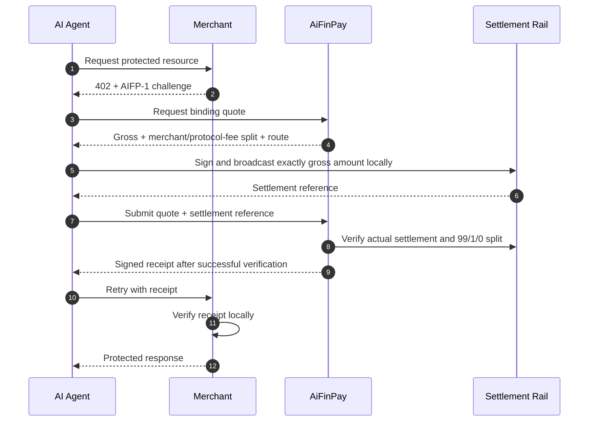

# AiFinPay AIFP-1 — Whitepaper

**A Merchant Monetization Layer for the Agent Economy**

**Document:** AIFP-DOC-05  
**Status:** Public draft  
**Updated:** August 15, 2026  
**Governed by:** [AIFP-1 RFC](./01-AIFP-1-RFC-Payment-Protocol-Specification.md)

This whitepaper explains the purpose and design direction of AIFP-1. It is descriptive, not a production-readiness attestation, regulatory approval, investment offer, or guarantee of adoption/revenue.

## 1. Executive Summary

AI agents increasingly consume websites, APIs, data, compute, and digital services directly. The human web monetizes attention through advertising and long-lived subscriptions; autonomous software often needs a different model: machine-readable access, explicit pricing, programmatic budgets, and payment tied to the resource being requested.

**AIFP-1** is AiFinPay's merchant AI-traffic monetization protocol profile. It uses HTTP `402 Payment Required` to tell an agent that a protected resource requires payment, then uses a binding quote, payer-executed settlement, settlement verification, a signed receipt, and a paid retry.

The core loop is:

`request → AIFP-1 402 → quote → settlement → verification → receipt → retry`

AIFP-1 is separate from **AIFP-2/x402**, the agent-payment route profile. The protocols can coexist in the same ecosystem but use different economic profiles and must not be conflated.

## 2. The Problem

A publisher, data provider, API operator, MCP server, or compute service faces a simple problem when autonomous agents arrive:

- block them and earn nothing from that traffic;
- give the resource away;
- force every agent into a human-oriented signup/subscription flow;
- build a custom API billing relationship with every consumer;
- or provide a machine-native way to price and pay for access.

AIFP-1 is aimed at the fifth option.

The goal is not to claim that every automated request should be charged. Merchants can define free access, paid access, allowlists, blocked traffic, subscriptions, API purchases, or enterprise contracts alongside AIFP-1.

## 3. Current AIFP-1 Economics

The reference action price is the **gross amount paid by the agent** for the AIFP-1 commercial action. The 1% AiFinPay protocol fee is deducted from gross; it is not added on top.

| Tier | Gross action price | Merchant 99% | AiFinPay 1% | Example workload |
|---|---:|---:|---:|---|
| `standard` | `$0.0005` | `$0.000495` | `$0.000005` | Simple read / lightweight API action |
| `complex` | `$0.002` | `$0.00198` | `$0.00002` | Search / aggregation / higher-compute action |
| `premium` | `$0.005` | `$0.00495` | `$0.00005` | AI inference / GPU / premium data action |

Current merchant-monetization fee profile:

```text
AIFP-1
  gross payer amount = 100% of quoted action price
  treasuryBps        = 100   # 1% of gross to AiFinPay
  creatorBps         = 0
  merchant amount    = 99% of gross
  payer total        = gross
  fee-on-top         = not permitted
```

Canonical relationship:

```text
merchant_amount + protocol_fee_amount + creator_amount = gross_amount
payer_total_amount = gross_amount
```

AIFP-2/x402 is separate:

```text
AIFP-2
  treasuryBps = 0
  creatorBps  = 0
```

The old `$0.00001 / $0.00006 / $0.00010` reference prices, a `100/1` creator-fee model, and fee-on-top AIFP-1 semantics are superseded current-product economics.

## 4. Protocol Flow



The crypto path is intended to be non-custodial at the payer-signing layer: the payer controls its signing key and sends AiFinPay the settlement reference for verification, not the key itself.

## 5. Why Receipt Verification Matters

A payment transaction proves that value moved somewhere. It does not by itself prove that a specific merchant resource should be unlocked.

AIFP-1 therefore binds paid access through a receipt that can represent:

- merchant/audience;
- resource or scope;
- quote/payment binding;
- gross paid amount or paid quota;
- issuance and expiry;
- replay/idempotency state;
- route/profile metadata.

Merchant-side verification is designed to be local where supported, so protected resource authorization does not require a synchronous callback to the payment control plane for every paid request.

## 6. Settlement Safety

AIFP-1's security model requires the system to answer one question before telling an agent to pay:

> Can the selected settlement route be independently verified against this quote and the required gross-inclusive economics?

If the answer is no, the route must fail before payment.

A receipt must not be issued merely because a client supplied a transaction hash. The verifier should confirm the chain/rail, contract/program, merchant recipient, token/asset, gross payer amount, merchant amount, AiFinPay fee amount, creator amount, quote/payment binding, finality, and current gross-inclusive `100/0` economics as applicable.

A route that reports `treasuryBps=100` but treats the quoted AIFP-1 action price as merchant net and adds the fee on top is economically incompatible with current AIFP-1 and must not be treated as payment-live.

This prevents both the failure mode in which the payer sends funds but the receipt service later discovers that it cannot interpret the transaction and the failure mode in which the payer is charged more than the quoted AIFP-1 commercial price.

## 7. Micropayments And Batching

Per-action prices can be much smaller than an economically sensible on-chain transaction. AIFP-1 therefore supports the idea of **metering actions separately from settlement frequency**.

For example, a merchant may meter many `$0.0005` gross actions and settle a prepaid or aggregated batch in one transaction. The critical requirement is reconciliation: the gross batch, remaining quota, merchant amount, creator amount, and protocol fee must remain mathematically consistent.

Batching may also solve base-unit rounding constraints. It must not be used to silently change the rule from fee-from-gross to fee-on-top.

AIFP-1 does not require one blockchain transaction per HTTP request.

## 8. Merchant Value

A merchant integrating AIFP-1 can aim to:

- monetize AI-agent access instead of automatically blocking it;
- define machine-readable gross pricing for content/API/data/compute actions;
- preserve control over free vs paid resources;
- receive cryptographically attributable paid access evidence;
- use exact per-resource or pooled metering;
- integrate payment alongside existing subscriptions, API contracts, and enterprise sales rather than replacing them.

AIFP-1 does not guarantee that a merchant will receive a particular volume of agent traffic or revenue. Traffic measurement and commercial assumptions need to be validated for each merchant.

## 9. Agent Value

For an agent, AIFP-1 is intended to make a paid resource machine-usable:

- learn that payment is required from HTTP `402`;
- obtain a deterministic gross quote and explicit 99/1/0 split;
- check budget and policy against the gross payer amount before spending;
- sign from its own wallet;
- settle exactly the quoted gross amount rather than gross plus an undisclosed percentage;
- receive a scoped receipt;
- retry the resource without a human checkout form.

The client should retain the ability to reject payments based on budget, merchant policy, route, asset, chain, or amount.

## 10. AIFP-1 Versus AIFP-2/x402

HTTP status `402` is a shared HTTP primitive, not a protocol identity.

| Dimension | AIFP-1 | AIFP-2/x402 |
|---|---|---|
| Primary purpose | Merchant AI-traffic/resource monetization | Agent x402-style payment route |
| Quoted price semantics | Gross payer amount | Provider-defined quoted amount |
| Current AiFinPay fee | `1%` of gross / `100` bps | `0%` |
| Merchant/provider settlement | `99%` of gross before external costs | `100%` of quoted provider amount before external costs |
| Creator/referral fee | `0` | `0` |
| Protocol classification | AIFP-1 challenge/quote/receipt | x402-compatible route/version |

A combined SDK may detect both, but it must keep route policy and economics separate.

## 11. Identity

AIFP-1 can consume authenticated agent identity where it exists, but identity is not defined by a caller-controlled header alone.

**AIFP-3 Agent Passport** is the separate identity/passport protocol surface. It should not be represented as an AIFP-1 payment object merely because identity can improve quota, trust, or attribution.

## 12. Multi-Chain Strategy

AiFinPay can deploy settlement infrastructure across multiple networks, but protocol documentation must distinguish:

1. a network where some AiFinPay code has been deployed;
2. a network with a canonical current payment target;
3. a network/asset with a working settlement verifier;
4. a network with a completed end-to-end AIFP-1 evidence bundle.

Only the relevant route should be described as payment-live. The protocol itself remains chain-agnostic; deployment readiness is an implementation fact.

## 13. Security Model

Key risk areas include:

- settlement spoofing;
- replay and duplicate receipt issuance;
- gross/net/fee semantic mismatch;
- route/registry drift;
- stale ABI/IDL or contract version assumptions;
- token decimal mismatch;
- budget concurrency races;
- SSRF in hosted merchant gateways;
- cross-resource/cross-merchant receipt reuse;
- free-quota identity spoofing;
- owner/admin compromise;
- chain reorg/finality behavior.

Smart-contract and payment-path releases require stronger review than ordinary documentation or UI changes.

## 14. Open Protocol And Conformance

AIFP-1 is maintained as an open draft specification. Conformance should be demonstrated through evidence, not marketing language.

For a payment-live route, useful evidence includes:

- exact source/version;
- canonical deployment target;
- gross-inclusive route economics;
- supported asset decimals;
- CI/tests;
- appropriate independent review;
- real/isolated end-to-end payment proof;
- receipt/replay tests;
- ledger/reconciliation evidence where applicable.

The repository may evolve through AIPs and versioned protocol changes.

## 15. Business Model

The current AIFP-1 protocol business model is simple: the **agent's quoted action price is gross**, and AiFinPay receives exactly 1% of that successful gross AIFP-1 merchant monetization transaction under the current `100/0` profile. The merchant receives the remaining 99% before external network/settlement costs. The 1% is not an extra surcharge above the quoted AIFP-1 action price.

AIFP-2/x402 currently has 0% AiFinPay protocol fee. Network gas or third-party settlement/facilitator costs are separate from AiFinPay's protocol revenue.

Future products, enterprise services, card/fiat rails, or other protocols may have separate commercial terms; they should not be silently encoded into AIFP-1.

## 16. Roadmap Principles

The protocol roadmap should prioritize correctness before breadth:

1. one canonical source of truth for economics and route registries;
2. verifier-before-payment safety;
3. exact gross/net/fee conservation across quote, SDK, contract, verifier, receipt, and ledger;
4. end-to-end evidence on each claimed payment-live route;
5. merchant onboarding and measurable real traffic;
6. durable financial ledger/reconciliation;
7. interoperable SDK/MCP surfaces;
8. additional chains/rails only when source provenance and verification are clear.

## 17. Status And Disclaimer

AIFP-1 is an experimental/draft protocol specification. It should not be described as production-ready solely because the specification, SDK interface, or contracts exist.

This whitepaper is descriptive. It is not legal, tax, investment, or securities advice, and it does not constitute an offer of a token or financial instrument.

## References

- [AIFP-1 RFC](./01-AIFP-1-RFC-Payment-Protocol-Specification.md)
- [Merchant Integration Guide](./02-Merchant-Integration-Guide.md)
- [Agent SDK Specification](./03-AI-Agent-SDK-Specification.md)
- [Security & Cryptography](./04-Security-and-Cryptography-Specification.md)
- [Protocol Economics](../economics.md)
