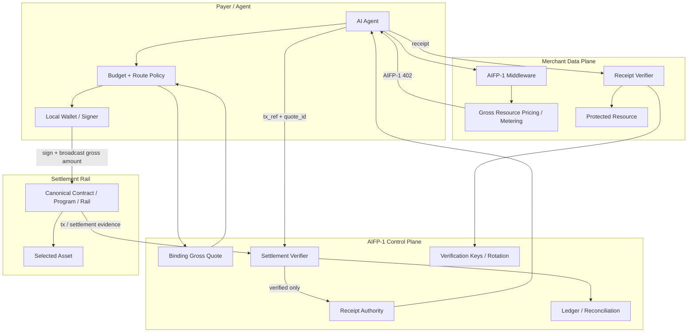

# AIFP-1 Architecture Overview

AIFP-1 separates merchant request authorization from payment settlement. The payer executes the selected settlement, a verifier confirms it against the binding quote, and a receipt authority issues paid-access proof. The merchant then verifies that proof locally before serving the protected resource.

## System Model



## Economic Profiles

| Route | Payer/quote semantics | Treasury | Creator/referral | Merchant/provider | Purpose |
|---|---|---:|---:|---:|---|
| **AIFP-1** | gross payer amount; no fee-on-top | `100` bps of gross | `0` bps | `99%` of gross before external costs | Merchant AI-traffic/resource monetization |
| **AIFP-2/x402** | provider-defined quoted amount | `0` bps | `0` bps | `100%` of quoted provider amount before external costs | Separate agent-payment route |

Current AIFP-1 gross reference prices are `$0.0005 / $0.002 / $0.005` for Standard / Complex / Premium.

Canonical AIFP-1 conservation:

```text
payer_total_amount = gross_amount
merchant_amount + protocol_fee_amount + creator_amount = gross_amount
protocol_fee_amount = 1% of gross
creator_amount = 0
```

The 1% protocol fee is deducted from gross and is not added on top.

## Trust Boundaries

| Boundary | Security requirement |
|---|---|
| Agent → merchant | A `402` challenge is not payment proof; protected access requires valid receipt/policy |
| Quote → payer | Quote must bind merchant/resource/gross amount/99-1 split/route and current gross-inclusive `100/0` economics |
| Payer wallet → settlement rail | Signing remains local to the payer and settles exactly the quoted gross amount in the non-custodial crypto flow |
| Settlement rail → verifier | Verifier checks actual chain/rail evidence, gross amount, merchant/protocol-fee split, and not merely the presence of a tx hash |
| Verifier → receipt authority | Receipt is issued only after successful settlement verification |
| Receipt → merchant | Merchant checks signature, audience, resource/scope, expiry, gross amount/quota and replay rules |

## Verifier-Readiness Gate

The quote service must not instruct the payer to send funds through a route that the active verifier cannot validate or whose settlement economics differ from the quote.

```text
route selected
  ↓
canonical target known?
  ↓ yes
asset decimals known?
  ↓ yes
SDK/transaction semantics known?
  ↓ yes
gross-inclusive 99/1/0 behavior proven?
  ↓ yes
verifier supports exact route/profile?
  ↓ yes
payable quote may be issued
```

Any required answer of `no` means fail **before payment**.

A target is not compatible merely because it exposes `treasuryBps=100`. If it treats the AIFP-1 gross reference price as merchant net and adds 1% on top, it is not current AIFP-1.

## Merchant Data Plane

The merchant side should remain small and deterministic:

1. identify protected resource and gross pricing/metering policy;
2. decide open/free/blocked/paid access;
3. return AIFP-1 `402` when payment is required;
4. validate receipt locally where supported;
5. consume/meter receipt quota atomically;
6. serve or reject the request.

A caller-controlled agent-ID header alone is not sufficient durable identity for abuse-resistant free quota.

## Settlement / Control Plane

Logical responsibilities include:

- binding gross quote issuance;
- route/deployment registry including gross-vs-net semantics;
- settlement verification and 99/1/0 conservation;
- receipt issuance;
- key publication/rotation;
- financial ledger/reconciliation;
- operational observability.

The exact hosted service topology is implementation-specific and is not guaranteed by this protocol architecture document.

## Multi-Chain Status

AIFP-1 is designed to be rail-agnostic, but documentation must distinguish:

- deployed code;
- canonical settlement target;
- verifier-ready route;
- SDK-ready route;
- gross-inclusive-economics verified route;
- E2E-verified route;
- approved payment-live route.

Do not use a raw network count as a substitute for these states.

## Protocol Boundaries

AIFP-3 Agent Passport may provide authenticated identity to an implementation, but it is not part of the normative AIFP-1 payment object model. AIFP-2/x402 may be handled by the same SDK, but its wire semantics and `0/0` economics remain separate.

## Repository Architecture

The public repository contains specifications, machine-readable API/schema artifacts, examples, and documentation. Actual production SDK/backend/contracts live in their own implementation repositories where applicable. This protocol repository must not imply that a documentation stub is a published production implementation.

The broader repository architecture guidance is maintained in [`docs/aifp/15-Repository-Architecture.md`](aifp/15-Repository-Architecture.md).
