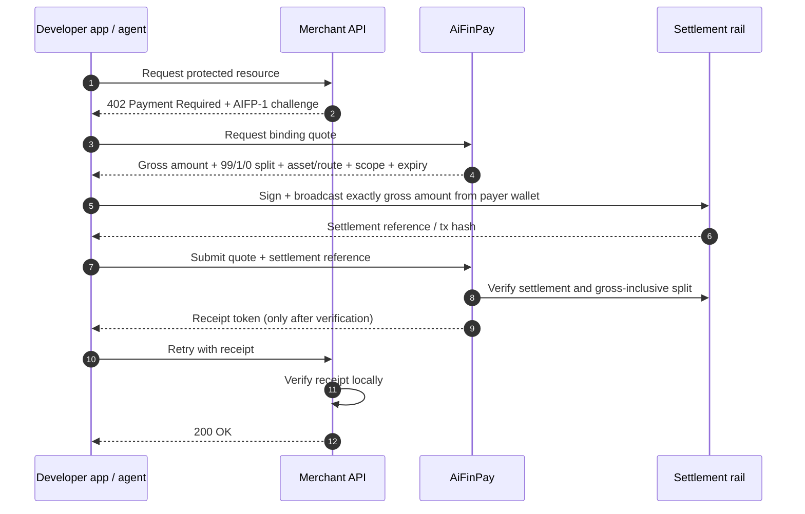

# AIFP-1 HTTP 402 Flow

> The file name is retained for link compatibility. This page describes the **AIFP-1 HTTP `402` merchant-monetization flow**, not the separate AIFP-2/x402 route profile.

AIFP-1 turns a protected HTTP request into a paid retry. It starts when a merchant returns `402 Payment Required`, continues through a binding quote and non-custodial settlement, and ends when the merchant verifies a receipt locally and serves the original resource.

## Terms

| Term | Meaning |
|---|---|
| `402 Payment Required` | An HTTP status indicating that payment is required before the protected resource can be served |
| AIFP-1 payment challenge | Machine-readable payload describing the merchant/resource, pricing information, quote path, and expiry/binding data |
| Quote | A binding gross payer price, 99/1/0 split, and settlement profile for a specific merchant resource/scope |
| Gross amount | Full AIFP-1 commercial amount settled by the payer, excluding external network/gas cost |
| Merchant amount | 99% merchant share of gross under the current AIFP-1 profile |
| Protocol fee amount | 1% AiFinPay share of gross under the current AIFP-1 profile |
| Settlement reference | On-chain or other supported proof/reference produced after the payer executes the quoted settlement |
| Receipt token | Signed proof issued only after settlement verification succeeds |
| Nonce / payment identifier | Uniqueness and replay-binding material |
| JWKS | JSON Web Key Set used by merchants to verify receipt signatures |

## The Loop



## Current Economics

AIFP-1 merchant monetization uses gross payer pricing:

| Tier | Gross paid by agent | Merchant 99% | AiFinPay 1% |
|---|---:|---:|---:|
| `standard` | `$0.0005` | `$0.000495` | `$0.000005` |
| `complex` | `$0.002` | `$0.00198` | `$0.00002` |
| `premium` | `$0.005` | `$0.00495` | `$0.00005` |

Canonical current relationship:

```text
payer_total_amount = gross_amount
protocol_fee_amount = 1% of gross (100 bps)
creator_amount = 0 (0 bps)
merchant_amount = gross_amount - protocol_fee_amount
```

The 1% AiFinPay fee is deducted from gross. It is **not added on top** of the advertised/quoted AIFP-1 action price.

**AIFP-2/x402 is separate and uses the `0/0` AiFinPay fee profile.** An implementation must not route an AIFP-2 payment through the AIFP-1 `100/0` profile or vice versa.

## What Happens Under The Hood

1. The merchant identifies a protected action/resource and returns an AIFP-1 challenge instead of serving it without payment.
2. The client requests a quote and receives the gross payer price, merchant amount, protocol-fee amount, creator amount, and route/binding data.
3. The client validates budget against gross and executes exactly the gross settlement amount from its own wallet or other explicitly supported payer rail.
4. AiFinPay verifies the settlement against the quote, including `payer_total_amount = gross_amount` and `merchant + protocol fee + creator = gross`, before issuing a receipt.
5. The merchant verifies receipt signature, audience, resource/scope, amount/quota, expiry, and replay/idempotency constraints locally before serving the request.

A route whose settlement verifier is unavailable or whose contract/backend implements fee-on-top AIFP-1 semantics must fail closed before payment is requested.

For the full developer path, use [Quick Start](../quickstart/index.md).

## Related Docs

- [Protocol Economics](../economics.md)
- [Security Model](../security-model.md)
- [Error Codes](../reference/error-codes.md)
- [Agent Communication Protocol](../aifp/16-Agent-Communication-Protocol-Specification.md)
- [AIFP-1 RFC](../aifp/01-AIFP-1-RFC-Payment-Protocol-Specification.md)
