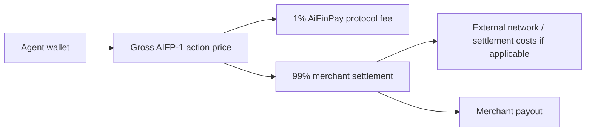

# Protocol Economics

AiFinPay prices agent work as small, explicit, resource-scoped actions. The merchant controls the action tier. The agent controls wallet policy and budget approval.

**Effective economics: 14 August 2026.**

## Action Pricing

| Tier | Starts From | Workload | Examples |
|---|---:|---|---|
| `standard` | `$0.0005` | Simple read, single record, lightweight API request | Profile lookup, status read, single-row retrieval |
| `complex` | `$0.002` | Search, aggregation, multi-source queries, higher compute | Search API, analytics aggregation, multi-source enrichment |
| `premium` | `$0.005` | AI inference, GPU workloads, deep analytics, premium data | LLM inference, premium data feed, GPU analytics job |

Merchants may price actions above these starting tiers according to resource value and workload.

## Fee Rule

| Rule | Value |
|---|---|
| AiFinPay Protocol Fee | **Exactly 1%** of every successful AIFP-1 monetization transaction (`treasuryBps = 100`) |
| Creator fee | **0%** (`creatorBps = 0`) |
| Merchant settlement | **99%** before external network or settlement costs |
| External costs | Gas, processor, payout, FX, or settlement rail costs may apply separately |
| Failed payment | No successful transaction fee |
| Receipt verification | Merchant verifies locally without a per-request control-plane call |

AIFP-1 economics are distinct from AIFP-2/x402 agent payments. AIFP-2 carries **0% AiFinPay protocol fee** (`treasuryBps = 0`, `creatorBps = 0`); the agent pays the provider/merchant amount plus the chain/network cost required for settlement.

## Settlement Flow

## Legacy economics

Older examples using `$0.00001 / $0.00006 / $0.00010` action tiers or a `100/1` treasury/creator split are superseded and must not be used for new AIFP-1 product or engineering work.

## Design Principles

- Prices should be discoverable before payment.
- Receipts should bind amount, merchant, resource, expiry, and nonce.
- Merchants should not have to run payment logic inside every protected route.
- Agents should be able to enforce budgets before payment.
- The protocol should work for tiny actions without introducing a native token.
- Fee accounting must identify the product route explicitly so AIFP-1 and AIFP-2 economics cannot be mixed.
