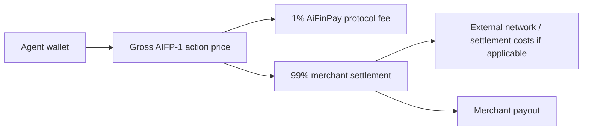

# Protocol Economics

AiFinPay prices agent work as small, explicit, resource-scoped actions. The merchant controls the action tier. The agent controls wallet policy and budget approval.

**Effective economics: 14 August 2026.**

## Action Pricing

The reference action price is the **gross amount paid by the agent**, excluding external network/gas costs. The AiFinPay protocol fee is deducted from this gross amount; it is not added on top.

| Tier | Gross price paid by agent | Workload | Examples |
|---|---:|---|---|
| `standard` | `$0.0005` | Simple read, single record, lightweight API request | Profile lookup, status read, single-row retrieval |
| `complex` | `$0.002` | Search, aggregation, multi-source queries, higher compute | Search API, analytics aggregation, multi-source enrichment |
| `premium` | `$0.005` | AI inference, GPU workloads, deep analytics, premium data | LLM inference, premium data feed, GPU analytics job |

Merchants may price actions above these starting tiers according to resource value and workload, but the same gross-inclusive fee rule applies unless a future protocol revision explicitly changes it.

## Fee Rule

| Rule | Value |
|---|---|
| Agent/payer commercial amount | **100% gross quoted amount** |
| AiFinPay Protocol Fee | **Exactly 1% of gross** (`treasuryBps = 100`) |
| Creator fee | **0%** (`creatorBps = 0`) |
| Merchant settlement | **99% of gross** before external network or settlement costs |
| Fee-on-top | **Not permitted for current AIFP-1 economics** |
| External costs | Gas, processor, payout, FX, or settlement rail costs may apply separately |
| Failed payment | No successful transaction fee |
| Receipt verification | Merchant verifies locally without a per-request control-plane call |

Canonical relationship:

```text
gross_amount = amount paid by the agent for the AIFP-1 action
protocol_fee_amount = gross_amount × 1%
creator_amount = 0
merchant_amount = gross_amount - protocol_fee_amount
payer_settlement_amount = gross_amount
```

In token base units, the calculation MUST use exact integer arithmetic and the actual token decimals. If the configured amount is too small for the 1% fee to produce a non-zero base-unit result, the route must fail closed or aggregate actions into a larger batch; it must not silently switch to fee-on-top semantics.

### Reference examples

| Tier | Gross paid by agent | Merchant 99% | AiFinPay 1% |
|---|---:|---:|---:|
| `standard` | `$0.0005` | `$0.000495` | `$0.000005` |
| `complex` | `$0.002` | `$0.00198` | `$0.00002` |
| `premium` | `$0.005` | `$0.00495` | `$0.00005` |

For a 6-decimal settlement asset these same examples are exactly:

```text
standard: 500 gross units  → 495 merchant + 5 AiFinPay
complex:  2000 gross units → 1980 merchant + 20 AiFinPay
premium:  5000 gross units → 4950 merchant + 50 AiFinPay
```

AIFP-1 economics are distinct from AIFP-2/x402 agent payments. AIFP-2 carries **0% AiFinPay protocol fee** (`treasuryBps = 0`, `creatorBps = 0`); the agent pays the provider/merchant quoted amount plus the chain/network cost required for settlement.

## Settlement Flow



## Legacy economics

Older examples using `$0.00001 / $0.00006 / $0.00010` action tiers, a `100/1` treasury/creator split, or an AIFP-1 fee added on top of the displayed action price are superseded and must not be used for new AIFP-1 product or engineering work.

## Design Principles

- Prices should be discoverable before payment and represent the gross commercial amount the agent is asked to settle.
- Receipts should bind gross amount, merchant amount, protocol fee amount, resource, expiry, and nonce/payment identity as applicable.
- Merchants should not have to run payment logic inside every protected route.
- Agents should be able to enforce budgets before payment using the gross payer amount.
- The protocol should work for tiny actions without introducing a native token.
- Fee accounting must identify the product route explicitly so AIFP-1 and AIFP-2 economics cannot be mixed.
