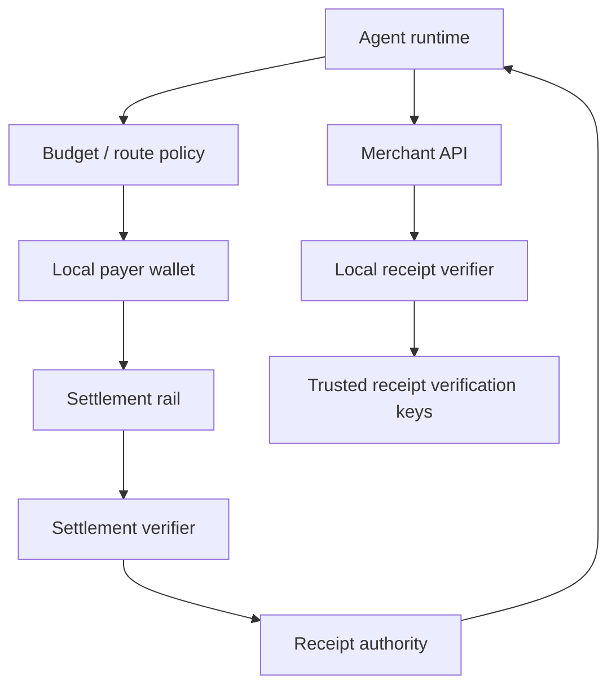

# Security Model

AIFP-1 treats a receipt as cryptographic paid-access authorization issued **after** the underlying settlement has been independently verified against a binding quote.

## Trust Boundaries

## Pre-Payment Checks

Before the payer signs/broadcasts:

- classify the protocol as AIFP-1 rather than AIFP-2/x402;
- bind the quote to merchant/resource/scope;
- require current AIFP-1 economics `100/0`;
- verify asset/chain/settlement target policy;
- ensure the active settlement verifier supports the route;
- enforce caller budget using concurrency-safe state where a durable cap is promised.

If the verifier cannot validate the selected route, fail before payment.

## Settlement Verification

A `tx_ref` alone is not payment proof. The verifier checks the actual rail evidence, including the applicable chain/contract/program, merchant, asset, amount, quote/payment binding, finality, and route economics.

Receipt issuance must fail closed on mismatch or unsupported verification.

## Required Receipt Checks

| Check | Requirement |
|---|---|
| Signature | Verify the active approved receipt signature profile/key |
| Issuer | Match a trusted receipt authority |
| Audience | Match the merchant |
| Resource/scope | Cover the requested protected resource |
| Amount/quota | Be sufficient under exact monetary/metering rules |
| Expiry | Reject expired authorization |
| Replay/consumption | Enforce the receipt's single-use or quota semantics atomically |
| Payment binding | Match the expected quote/settlement identity where included |

Do not assume every receipt nonce is universally single-use: quota/multi-use receipts require atomic metering rather than a blanket one-use rule.

## Operational Controls

- Keep signing material out of source, logs, and client payloads.
- Rotate verification keys with a safe overlap policy for still-valid receipts.
- Record quote/payment/receipt IDs, merchant, route class, amounts, asset/chain, verifier outcome, and settlement reference for reconciliation.
- Never log private wallet keys, recovery phrases, or full bearer credentials.
- Treat webhook verification as mandatory before mutating financial/merchant state.
- Detect any current AIFP-1 creator amount above zero or treasury profile other than `100` bps unless the record is explicitly legacy.

See the canonical [Security and Cryptography Specification](aifp/04-Security-and-Cryptography-Specification.md).
