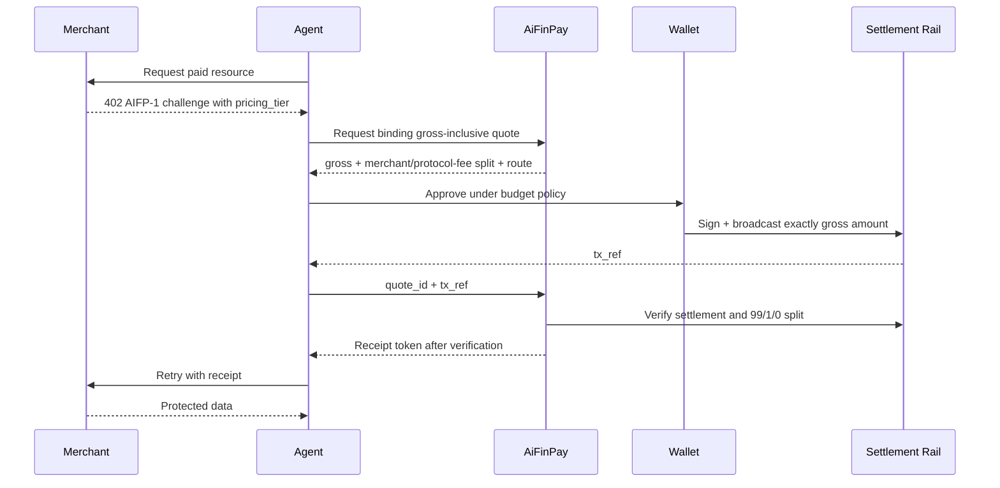

# Examples

Examples show the canonical AIFP flow from multiple perspectives. They are written as copyable implementation recipes and must remain aligned with OpenAPI, JSON Schemas, and AIFP-1.

## Example Catalog

| Example | Purpose |
|---|---|
| [Merchant Basic](merchant-basic.md) | Protect a resource with AIFP middleware |
| [Agent Autopay](agent-autopay.md) | Agent detects `402`, pays, and retries |
| [Wallet Funding](wallet-funding.md) | Wallet setup and budget policy |
| [Webhook Verification](webhook-verification.md) | Merchant verifies signed webhooks |
| [Raw HTTP 402](curl-http-402.md) | End-to-end cURL flow for quote, pay, retry |
| [Receipt Verification](receipt-verification.md) | Local receipt validation checklist and pseudocode |

## End-to-End Flow

## Pricing Contract

All current AIFP-1 examples use gross payer prices:

| Tier | Gross paid by agent | Merchant 99% | AiFinPay 1% |
|---|---:|---:|---:|
| `standard` | `$0.0005` | `$0.000495` | `$0.000005` |
| `complex` | `$0.002` | `$0.00198` | `$0.00002` |
| `premium` | `$0.005` | `$0.00495` | `$0.00005` |

The AIFP-1 merchant-monetization profile is gross-inclusive: `payer_total_amount = gross_amount`, AiFinPay receives exactly 1% (`100` bps) from gross, creator/referral fee is 0 bps, and merchant settlement is 99% before external network or settlement costs. The 1% fee is not added on top. AIFP-2/x402 uses a separate `0/0` profile.
