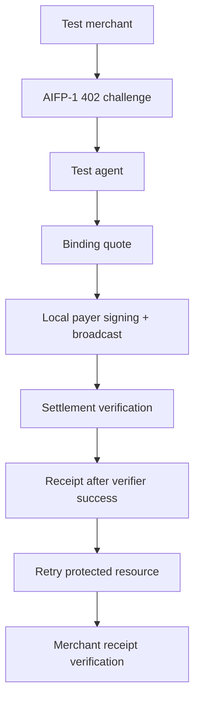

# Sandbox

This directory is the design entry point for a **local or explicitly configured AIFP-1 test environment**. The protocol repository does not guarantee that a public hosted sandbox exists.

Do not infer a sandbox URL, test key, faucet, or payment-live chain from this document. Use only environments that the active implementation repository or deployment runbook explicitly provides.

## Test Flow

## Required Test Economics

| Item | Current AIFP-1 value |
|---|---:|
| Standard | `$0.0005` |
| Complex | `$0.002` |
| Premium | `$0.005` |
| Treasury | `100` bps |
| Creator/referral | `0` bps |

AIFP-2/x402 is a separate `0/0` route and must not be substituted during AIFP-1 testing.

## Core Test Cases

| Case | Expected behavior |
|---|---|
| No receipt | Merchant returns an AIFP-1 `402` challenge |
| Verifier unavailable | Quote/payment path fails **before funds are requested** |
| Wrong route economics | Client/backend rejects before signing or receipt issuance |
| Valid verified settlement | Exactly one receipt entitlement is created |
| Pending finality | Returns pending state; caller reconciles rather than paying again |
| Underpayment / wrong merchant / wrong asset | Settlement verification fails closed |
| Expired or invalid receipt | Merchant rejects access |
| Duplicate settlement / replay | No second independent paid entitlement |
| Concurrent quota use | Atomic metering prevents overspend |

## Going Beyond Local Tests

A public testnet/mainnet route should only be documented here after the route has a canonical target, known token decimals, working SDK transaction construction, settlement verifier support, and route-specific E2E evidence.
